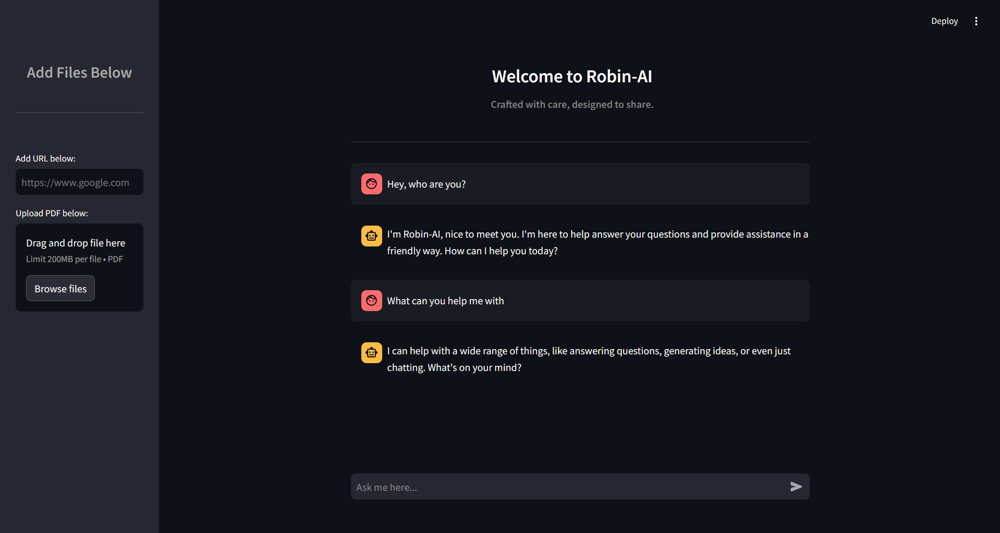

# Robin-AI: Conversational AI Assistant for PDFs and URLs

**Robin-AI** is a smart conversational assistant designed to answer your queries based on the content of uploaded PDFs or provided URLs. Powered by OpenAI and LangChain, it delivers accurate, context-aware responses.



---

## 🚀 Features

- **PDF Support**: Upload PDFs to get tailored, context-specific answers.
- **URL Processing**: Provide URLs to extract relevant content and receive insightful responses.
- **AI-Driven Intelligence**: Delivers responses using advanced language models.
- **Fast Search**: Uses FAISS indexing for rapid and precise content retrieval.

---

## 🛠️ Requirements

Ensure you have the following:

- **Python 3.7+**
- **Streamlit**
- **OpenAI**
- **LangChain**
- **FAISS**
- **Groq API Key**

Install all dependencies by running:

```bash
pip install -r requirements.txt  
```

---

## ⚙️ Setup

1. **Clone the Repository**:

   ```bash
   git clone https://github.com/Singh-Wizard/robin-ai.git  
   cd robin-ai  
   ```

2. **Set Up Environment Variables**:\
   Create a `.env` file in the root directory and add your Groq API key:

   ```
   GROQ_API_KEY=your-groq-api-key  
   ```

3. **Run the Application**:\
   Launch the app using Streamlit:

   ```bash
   streamlit run app.py  
   ```

4. **Access the App**:\
   Open your browser and visit `http://localhost:8501` to interact with Robin-AI.

---

## 🫩 How It Works

1. **Upload or Input**: Use the sidebar to upload a PDF or input a URL.
2. **Interactive Responses**: Ask questions, and Robin-AI will respond based on the document's content.
3. **Advanced Search**: Leverages embeddings and FAISS to provide accurate answers.

---

## 🔒 Backend Highlights

- **Document Processing**: LangChain ensures efficient document loading and splitting.
- **Vector Search**: FAISS enables quick and accurate content retrieval.
- **Context-Aware AI**: Powered by Groq API for generating intelligent responses.

---

## 🧵 Contributing

We welcome contributions! Fork the repository, make your changes, and submit a pull request.

---

Enjoy exploring with **Robin-AI**! 🎉